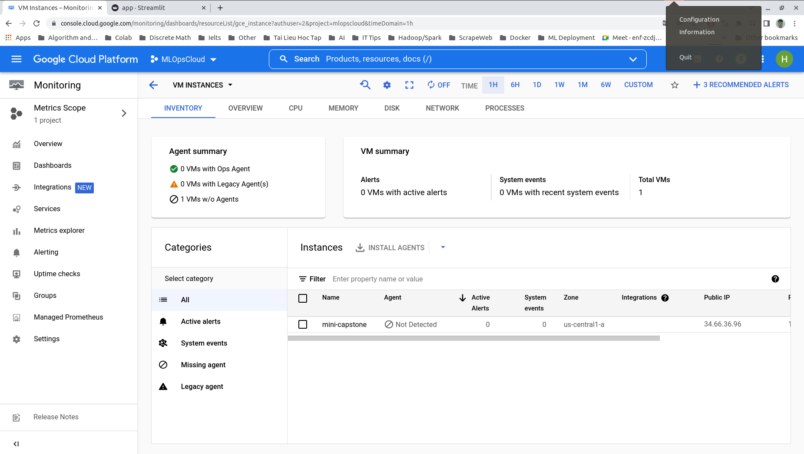

## CIFAR-100 transfer learning using EfficientNet

### CIFAR-100 dataset
* CIFAR-100 has 1000 classes containing 600 images each. There are 500
training images and 100 testing images per class.
* 

### Training
* In our training process, train, val, test dataset size are 40000, 10000,10000 respectively.
* Run script below to train model:
```angular2html
python3 train.py --batch-size 32 --epochs 50 --wandb-project <project-name>
```
* I use [wandb](https://docs.wandb.ai/quickstart) to track experiments. I can monitor metrics on wandb dashboard:


### Deploy
* I used FastAPI to serve my model and designed basic frontend by [streamlit](https://streamlit.io/).
* API docs:

* FE:


### Dockerize
* I dockerized the service to redeploy on GCP VM instances.
* [Backend Dockerfile](docker/api/Dockerfile)
* [Frontend Dockerfile](docker/api/Dockerfile)
* [docker-compose file](docker-compose.yml)
* Instance Monitoring:
